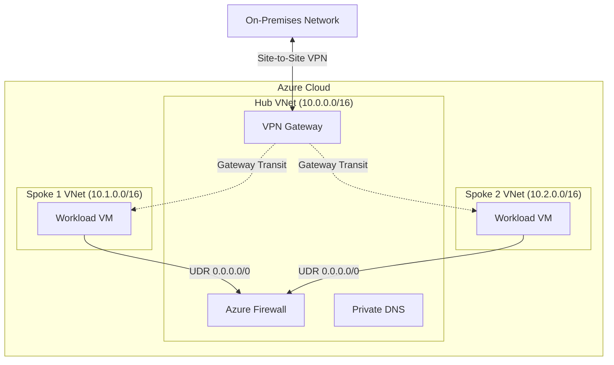

# Secure Hub-and-Spoke Network (Bicep)

This repository contains a comprehensive **Bicep** implementation of a Secure Hub-and-Spoke network topology in Azure. This architecture is a common pattern for organizing workloads that require shared services, centralized security, and connectivity effectively.

## 🗺️ Architecture Diagram



## 🏗️ Components

The solution consists of the following key components:

1.  **Hub Virtual Network**: The central point of connectivity.
    - **Azure Firewall**: Inspects and filters traffic (East-West and North-South).
    - **VPN Gateway**: Provides secure connectivity to on-premises networks.
    - **Private DNS Zones**: Centralized name resolution for internal resources.
2.  **Spoke Virtual Networks**: Isolated environments for workloads.
    - **VNet Peering**: Connects Spokes to the Hub.
    - **User Defined Routes (UDR)**: Forces all outbound traffic from Spokes to the Azure Firewall for inspection.
3.  **Network Watcher**: Enabled for monitoring and flow logs.

## 📂 Project Structure

| File                           | Description                                                 |
| :----------------------------- | :---------------------------------------------------------- |
| `main.bicep`                   | **Orchestrator**. Deploys all modules in the correct order. |
| `modules/vnet.bicep`           | Creates Virtual Networks and Subnets.                       |
| `modules/peering.bicep`        | Configures VNet Peering with Gateway Transit settings.      |
| `modules/firewall.bicep`       | Deploys Azure Firewall (Standard) + Public IP + Policy.     |
| `modules/routetable.bicep`     | Creates Route Tables (UDRs) for traffic redirection.        |
| `modules/vpngateway.bicep`     | Deploys VPN Gateway (VpnGw1).                               |
| `modules/dns.bicep`            | Creates Private DNS Zones and Links.                        |
| `modules/networkwatcher.bicep` | Ensures Network Watcher is enabled.                         |

## 🚀 Deployment

### Prerequisites

- An active **Azure Subscription**.
- **Azure CLI** installed ([Install Guide](https://learn.microsoft.com/en-us/cli/azure/install-azure-cli)).
- **Bicep CLI** (usually included with Azure CLI).

### Steps

1.  **Login to Azure**:

    ```bash
    az login
    ```

2.  **Create a Resource Group**:

    ```bash
    az group create --name SecureHubSpokeRG --location eastus
    ```

3.  **Deploy the Bicep Template**:
    ```bash
    az deployment group create \
      --resource-group SecureHubSpokeRG \
      --template-file main.bicep
    ```

## ✅ Verification

Once deployed, you can verify the setup:

1.  **Check Topology**: Go to **Network Watcher** > **Topology** in the Azure Portal to visualize the connected VNets.
2.  **Verify Routing**:
    - Deploy a test VM in `Spoke1`.
    - Go to the VM's Network Interface > **Effective Routes**.
    - You should see a route for `0.0.0.0/0` with **Next Hop Type** as `Virtual Appliance` and the IP matching the **Azure Firewall**.
3.  **Check DNS**:
    - The Private DNS Zone `internal.corp` should show a Virtual Network Link to the Hub VNet.

## ⚠️ Notes

- **Cost**: This deployment includes an **Azure Firewall** and **VPN Gateway**, which incur hourly costs even when idle. **Delete the resource group** when not in use to avoid unexpected charges.
  ```bash
  az group delete --name SecureHubSpokeRG --yes --no-wait
  ```
- **Firewall Rules**: The default policy created (`modules/firewall.bicep`) allows **ALL** traffic for demonstration purposes. In a production environment, you should lock this down to specific rules.

## 🤝 Contributing

Feel free to submit issues or pull requests to improve this architecture!
